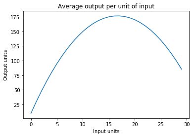
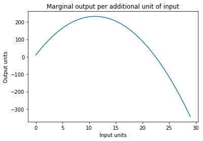
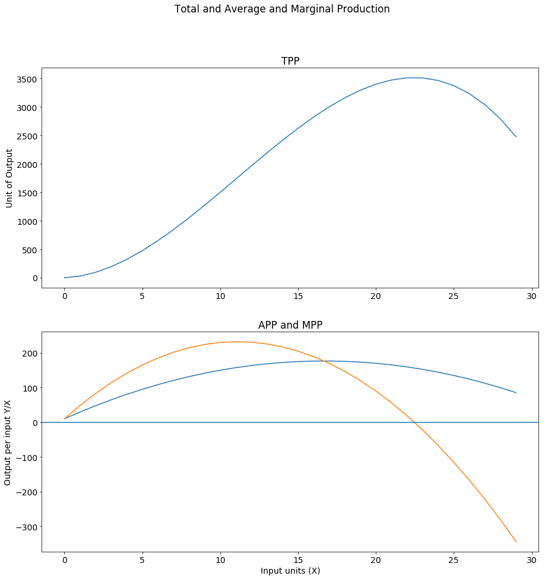
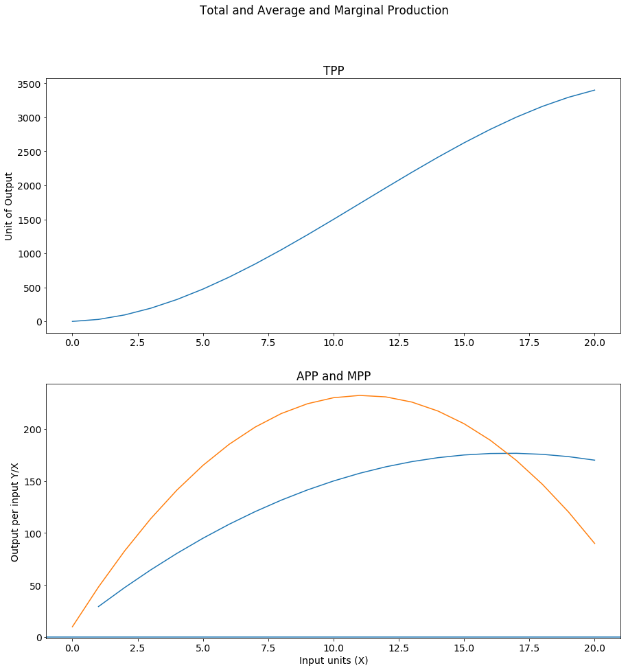

---
redirect_from:
  - "/econ-fa19/wk02/intro-to-production"
interact_link: content/econ-fa19/wk02/Intro_to_Production.ipynb
kernel_name: python3
title: 'Intro to Production'
prev_page:
  url: /econ-fa19/wk02/Horizontal_Sum_Supply
  title: 'Horizontal Sum Supply'
next_page:
  url: /econ-fa19/wk02/lab02
  title: 'Lab 2'
comment: "***PROGRAMMATICALLY GENERATED, DO NOT EDIT. SEE ORIGINAL FILES IN /content***"
---
# Introduction to Production

## Total Output

Imagine that we have a production function is as follows: 

$$\Large f(x) = -0.6x^3+20x^2+10x$$

Where $x$ is our production input and $f(x)$ is the units of output. For simplicity, we can think of both in dollar terms. 


{:.input_area}
```python
def graph(formula, x_range, title):  
    x = np.array(x_range)  
    y = formula(x)  # <- note now we're calling the function 'formula' with x
    plt.plot(x, y)
    plt.xlabel("Input units")
    plt.ylabel("Output units")
    plt.title(title)
    plt.show()  

def TPP(x):
    return -0.6*x**3+20*x**2+10*x

graph(TPP, range(0, 30), "Total output with respect to inputs")
```


{:.output .output_png}


Here is something interesting to note: when we feed in too many inputs, production actually decreases! Typically, this does not happen, but for this example we can imagine that perhaps hiring too many laborers will reduce the overall output of our production.

## Average Output

The average production function is the average number of output for each input unit. The formula is as follows:

$$\begin{aligned} 
\frac{f(x)}{x} &= \frac{-0.6x^3+20x^2+10x}{x} \\
&= -0.6x^2+20x+10 \\
\end{aligned}$$


{:.input_area}
```python
def APP(x):
    return -0.6*x**2+20*x+10

graph(APP, range(0, 30), "Average output per unit of input")
```


{:.output .output_png}



## Marginal Output

The marginal production function is the marginal units of output for each additional unit of input. The formula is as follows:

$$\Large \frac{d f(x)}{d x} = -1.8x^2+40x+10$$


{:.input_area}
```python
def MPP(x):
    return -1.8*x**2+40*x+10

graph(MPP, range(0, 30), "Marginal output per additional unit of input")
```


{:.output .output_png}



Combining all 3 functions:


{:.output .output_png}



## Think Pair Share
If you were a supplier, how many input units would you use?

## As a Data Set

Let's think about this as a data set. Consider the data set imported below:


{:.input_area}
```python
TPP = Table().read_table("tableTPP.csv")
TPP.show(20)
```


<div markdown="0" class="output output_html">
<table border="1" class="dataframe">
    <thead>
        <tr>
            <th>Input (x)</th> <th>Output_Y</th> <th>Average_Product</th> <th>Discrete_MP</th> <th>Marginal_Product</th>
        </tr>
    </thead>
    <tbody>
        <tr>
            <td>0        </td> <td>0       </td> <td>nan            </td> <td>nan        </td> <td>10              </td>
        </tr>
        <tr>
            <td>1        </td> <td>29.4    </td> <td>29.4           </td> <td>29.4       </td> <td>48.2            </td>
        </tr>
        <tr>
            <td>2        </td> <td>95.2    </td> <td>47.6           </td> <td>65.8       </td> <td>82.8            </td>
        </tr>
        <tr>
            <td>3        </td> <td>193.8   </td> <td>64.6           </td> <td>98.6       </td> <td>113.8           </td>
        </tr>
        <tr>
            <td>4        </td> <td>321.6   </td> <td>80.4           </td> <td>127.8      </td> <td>141.2           </td>
        </tr>
        <tr>
            <td>5        </td> <td>475     </td> <td>95             </td> <td>153.4      </td> <td>165             </td>
        </tr>
        <tr>
            <td>6        </td> <td>650.4   </td> <td>108.4          </td> <td>175.4      </td> <td>185.2           </td>
        </tr>
        <tr>
            <td>7        </td> <td>844.2   </td> <td>120.6          </td> <td>193.8      </td> <td>201.8           </td>
        </tr>
        <tr>
            <td>8        </td> <td>1052.8  </td> <td>131.6          </td> <td>208.6      </td> <td>214.8           </td>
        </tr>
        <tr>
            <td>9        </td> <td>1272.6  </td> <td>141.4          </td> <td>219.8      </td> <td>224.2           </td>
        </tr>
        <tr>
            <td>10       </td> <td>1500    </td> <td>150            </td> <td>227.4      </td> <td>230             </td>
        </tr>
        <tr>
            <td>11       </td> <td>1731.4  </td> <td>157.4          </td> <td>231.4      </td> <td>232.2           </td>
        </tr>
        <tr>
            <td>12       </td> <td>1963.2  </td> <td>163.6          </td> <td>231.8      </td> <td>230.8           </td>
        </tr>
        <tr>
            <td>13       </td> <td>2191.8  </td> <td>168.6          </td> <td>228.6      </td> <td>225.8           </td>
        </tr>
        <tr>
            <td>14       </td> <td>2413.6  </td> <td>172.4          </td> <td>221.8      </td> <td>217.2           </td>
        </tr>
        <tr>
            <td>15       </td> <td>2625    </td> <td>175            </td> <td>211.4      </td> <td>205             </td>
        </tr>
        <tr>
            <td>16       </td> <td>2822.4  </td> <td>176.4          </td> <td>197.4      </td> <td>189.2           </td>
        </tr>
        <tr>
            <td>17       </td> <td>3002.2  </td> <td>176.6          </td> <td>179.8      </td> <td>169.8           </td>
        </tr>
        <tr>
            <td>18       </td> <td>3160.8  </td> <td>175.6          </td> <td>158.6      </td> <td>146.8           </td>
        </tr>
        <tr>
            <td>19       </td> <td>3294.6  </td> <td>173.4          </td> <td>133.8      </td> <td>120.2           </td>
        </tr>
    </tbody>
</table>
<p>... (1 rows omitted)</p>
</div>


Now, we plot the total, average, and marginal production for this data.


{:.output .output_png}



_This is the same graph as it comes from the same function!_

 
